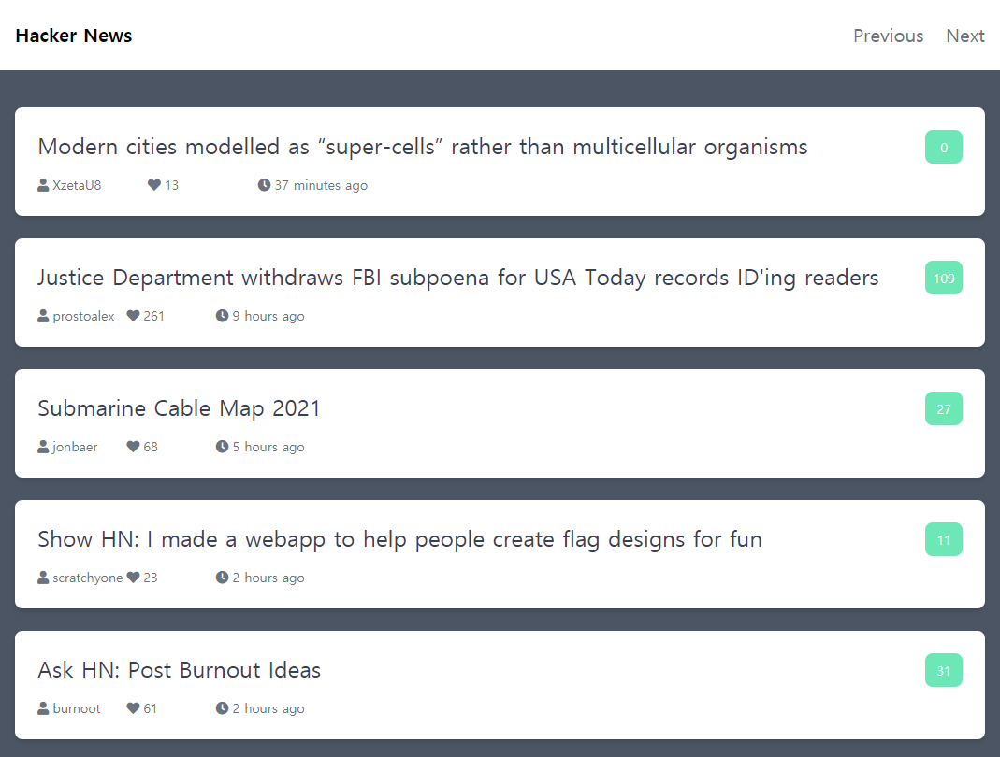
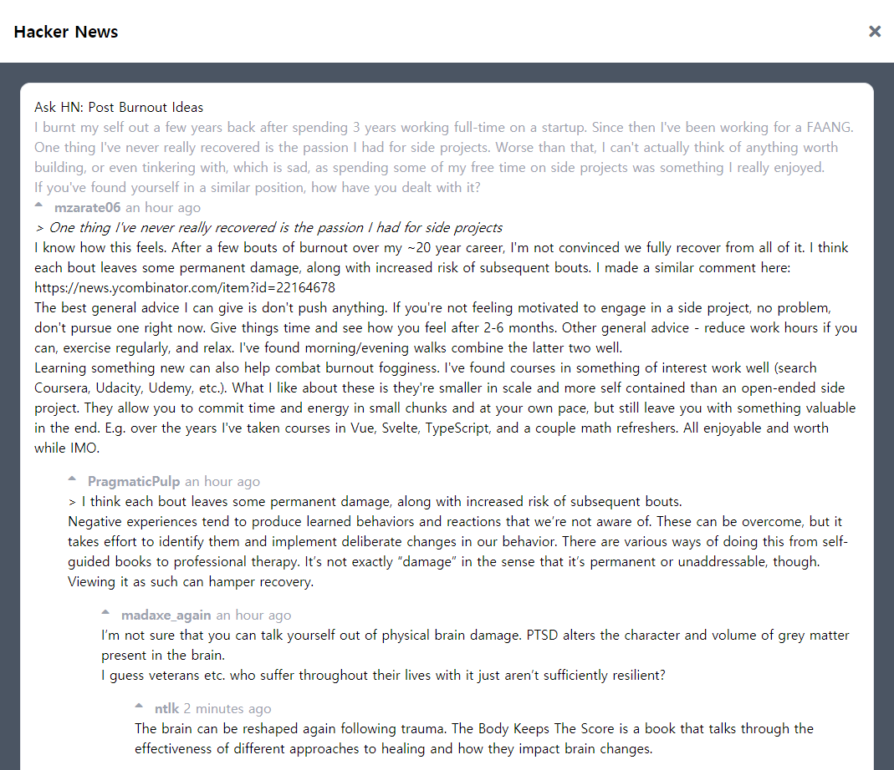

# Hacker News Client App

> '김민태의 프론트엔드 아카데미' 강의를 정리했습니다.


## 서비스 개요

- 해커뉴스 API에서 받아오는 뉴스 정보 제공


## 기술 스택

- Language - , , 

- Bundler - 


## 활용 API

- [HNPWA API](https://github.com/tastejs/hacker-news-pwas/blob/master/docs/api.md)
- [tailwindcss](https://tailwindcss.com/)
- [font-awesome](https://fontawesome.com/)


## 화면 구성

|                             Main                             |                             News                             |
| :----------------------------------------------------------: | :----------------------------------------------------------: |
|  |  |


## 실행 방법

```bash
parcel index.html
```

